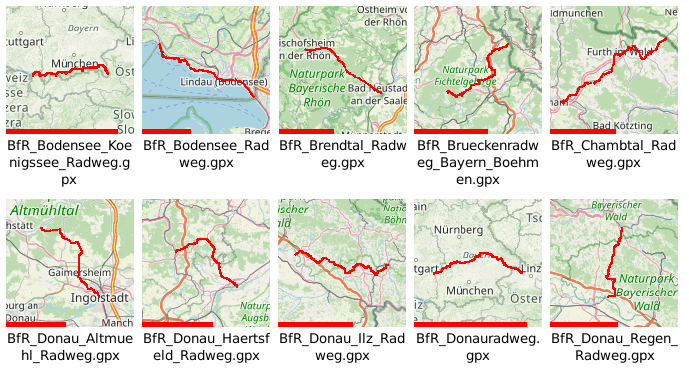

# gpx_thumbnailer

# Motivation to write and use it
I have a lot of gpx files from a data logger on my storage. I wanted to see at a glance, which file contains which track. 
I am working with debian linux file managers under the desktop environment sfce, which can generate user defined thumbnails from files
So I adapted the script from Pavel to generate previews and added a thumbnailer definition to generate thumbnails for the tumblerd daemon, used e.g. by thunar  

# Prerequisites
- basic Python knowledge
- gpxpy https://pypi.python.org/pypi/gpxpy
- pillow https://pypi.python.org/pypi/Pillow

# Description
- iterates through GPX files in a directory as requested by tumblerd
- downloads (steals) map tiles of location into the hard-coded cache directory (works with tiles from openstreetmap.org or mapy.cz)
- creates the image with the map of area
- draws track segments from GPX files
- draws a logarithmic length bar to view length of track  
- saves the image

# Notes
- few things are hardcoded at different places, sorry for that

# Result (example)
In the file explorer, e.g. thunar it looks like this:

